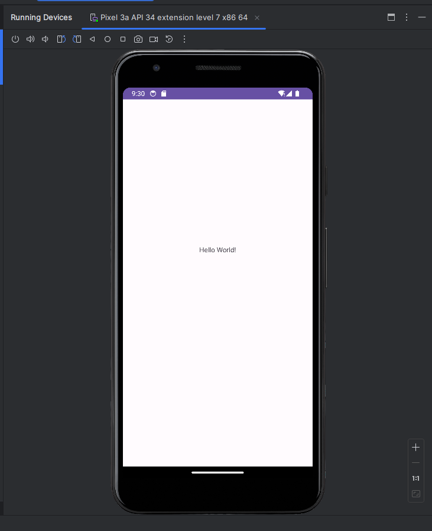
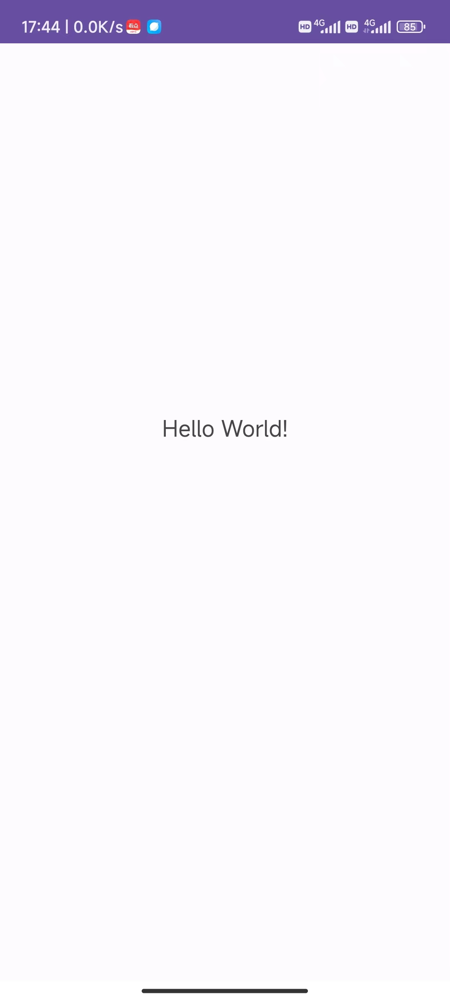

# Lab1 Helloworld程序

## 程序功能

* 运行程序后，显示`Hello World!`字符串

 

## 开发运行相关

1. 开发语言：Java
2. 开发环境：Android Studio
3. 运行环境：Android 7.0及以上
4. 涉及的工具包：
* 主要依赖：
    - `androidx.appcompat:appcompat 1.6.1`
    - `com.google.android.material:material 1.8.0`
    - `androidx.constraintlayout:constraintlayout 2.1.4`

* 测试依赖:
    - `junit:junit 4.13.2`
    - `androidx.test.ext:junit 1.1.5`
    - `androidx.test.espresso:espresso-core 3.5.1`

5. 编译链接步骤：
    1. 在Android Studio中打开项目
    2. 在SDK Manager中安装必要的SDK。
    3. 点击工具栏上的`Run`按钮，选择`Run 'app'`，即可在模拟器上运行程序。
    4. 若要在真机上运行debug.apk，在`build`菜单栏中选择`build-bundle(s)/APK(s)`，然后在弹出的窗口中选择`Build APK(s)`，即可在`app/build/outputs/apk/debug`中生成apk文件。
    5. 获得release版本：在`build`菜单栏中选择`Generate Signed Bundle/APK`，然后在弹出的窗口中选择`APK`，即可在`app/release`中生成apk文件。

* **注：本lab已经将apk文件放在`app/release/app-release.apk`中，可以直接在Android7.0及以上系统上安装运行以进行测试。**

   

## 实际运行效果截图

1. 在Android Studio开发工具中模拟运行效果如下图所示：

2. 在小米13(Android 14)真机运行如图所示：

