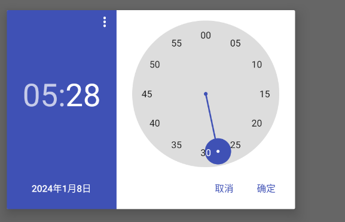

# Part 1: 想法与设计

## 1.1 创新想法 (innovative idea)

我们的产品OmniNotes是一个轻量级的多功能笔记应用，旨在通过简化用户界面和增加直观的操作来提高用户记录笔记和管理待办事项的效率。OmniNotes的创新之处在于其“一站式”工作流程设计，能够让用户在单一应用内通过一个非常简洁的界面，即可完成记录、整理和提醒等多种任务，并且清晰地显示在用户的主界面上。

## 1.2 目标 (objective)

* **提升用户效率**：通过简化笔记的捕捉、整理和检索过程，节省用户的时间，使他们能够更快地记录信息并提高工作效率。
* **简化使用**：去除繁琐的功能，简化用户界面，以实现及时的、快速的笔记记录。

## 1.3 用户画像 (persona)
* 李明：一名程序员，经常需要记录代码片段和项目会议的重要信息。
* 王芳：一位教师，需要为每堂课制定教学计划并记录学生反馈。
* 张强：一名学生，使用笔记应用来管理学习笔记和备考计划。

## 1.4 用户故事 (user story)
* 用户故事1：会议笔记整合

    作为一名项目经理的李明，他希望能在参加完项目会议后，通过OmniNotes迅速记录下会议的要点和决策事项。他需要这些笔记能够自动转化为待办事项，并设置提醒，以便跟踪项目的后续行动和截止日期。
 
* 用户故事2：教学计划的组织

    王芳是一位中学教师，她需要一个能够帮助她组织每周教学计划和记录学生反馈的工具。通过OmniNotes，她希望能够为每个班级创建一个独立的笔记本，并在其中安排课程内容、作业和测试，同时轻松地查找和回顾过往的笔记。
 
* 用户故事3：学习管理和复习提醒

    张强是一名大学生，他需要管理繁重的学习任务和准备期末考试。他使用OmniNotes来创建每门课程的笔记和复习提醒。张强希望应用能够让他标记重要概念，并在考试前自动提醒他复习特定的笔记。
 
* 用户故事4：日常生活的记录

    李华是一位自由撰稿人，他经常需要记录灵感和日常生活的点滴。他使用OmniNotes的标签功能来分类他的笔记，并且可以将一些想法设为待办事项，安排特定的时间来进一步发展这些想法。
 

## 1.5 用户任务 (user task)
1. **浏览和记录信息**：
   - 用户打开Omni Notes应用，浏览不同分类或使用搜索功能找到他们想要记录的信息类型。

2. **创建和添加笔记**：
   - 用户选择他们想记录的信息类型并创建新的笔记。

3. **整理和审查笔记**：
   - 用户查看他们的笔记或待办事项列表，对内容进行审查和编辑。

4. **设置提醒和截止日期**：
   - 用户可以为特定笔记或任务设置提醒和截止日期。

5. **完成任务和跟踪进度**：
   - 用户执行他们的任务，例如学习、会议准备或写作，并在完成后标记任务状态。

通过这些用户任务，Omni Notes用户可以高效地管理他们的信息和待办事项，确保工作和学习的顺利进行。
这些任务旨在提高用户的组织能力和生产效率，同时保持信息的整洁和可访问性。

## 1.6 主要页面UI设计 (UI design)

### 1.6.1 笔记列表界面（主界面）

* 这是OmniNotes的主界面，用户可以在这里查看所有笔记的列表。
* 在这个界面中，用户可以通过点击左上角的菜单按钮来打开侧边栏调整设置、通过分类查找笔记，也可以通过点击右下角的加号按钮来创建新的笔记。
* 笔记界面以列表形式展示，支持侧滑归档或删除。
* 用户可以通过点击笔记列表中的笔记来查看笔记的详细内容并进行修改，也可以通过点击右上角的搜索按钮来搜索笔记，或点击排序按钮进行不同方式对笔记进行排序。
* 用户可以通过不同颜色的标签来区分不同的笔记，并在该页面中直观地标记处不同种类的笔记
* 对于“待办事项”笔记，用户可以在该界面直观地看到还有哪些待办事项，以及是否有设置提醒。

### 1.6.2 笔记编辑界面

* 这是点击一项笔记或在主界面点击加号按钮后进入的笔记编辑界面。
* 在这个界面中，用户可以通过文本编辑界面编辑笔记的标题和内容，并可以通过点击右上角的按钮来设置笔记的标签、提醒和待办事项等，并插入附件、时间戳等项目，如下图所示。

* 另外，点击“添加提醒”按钮后，用户可以直观便捷地设置提醒的时间和日期，并可以选择是否重复提醒。用户可以通过点击或拖动虚拟时钟的指针或直接输入数字来设置提醒的时间，也可以通过点击日历来设置提醒的日期。

* 在更新成功或失败后，系统会弹窗提示用户，并在主界面进行更新。

### 1.6.3 设置界面

* 打开侧边栏后，可以点击“设置”按钮进入设置界面。
* 设置界面可以由用户对APP进行设置，同时也提供了用户手册、更新日志、统计（如下图）等功能。
